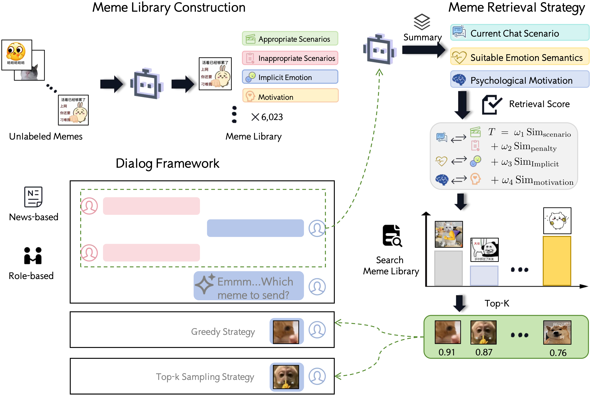

# MemeCMD: An Automatically Generated Chinese Multi-turn Dialogue Dataset with Contextually Retrieved Memes




[](https://arxiv.org/abs/2507.00891)
[](LICENSE)

An automatically generated Chinese multi-turn dialogue dataset with contextually retrieved memes, featuring sophisticated meme retrieval and context-aware matching using role-based embeddings and advanced similarity scoring algorithms.


## 🚀 Overview

MemeCMD presents an automatically generated Chinese multi-turn dialogue dataset that integrates contextually retrieved memes to enhance conversational experiences. This innovative dataset addresses the growing need for culturally relevant and context-aware dialogue systems in Chinese social media and messaging applications.

The project combines cutting-edge meme retrieval technology with authentic Chinese conversational patterns, employing role-based embeddings and weighted cosine similarity metrics to identify the most contextually appropriate memes for dialogue scenarios. This makes it an invaluable resource for researchers working on:

- **Chinese conversational AI development**
- **Multimodal dialogue systems**
- **Cultural context understanding in AI**
- **Social media content generation**
- **Cross-cultural communication research**

## ✨ Key Features

### 📊 Dataset Contributions
- **🇨🇳 Chinese Multi-turn Dialogues**: Authentic Chinese conversational patterns across multiple domains
- **🎭 Role-based Scenarios**: Diverse conversation roles (news-based and role-based dialogues)
- **🖼️ Contextual Meme Integration**: 6000+ carefully curated memes with contextual relevance
- **🔄 Multiple Turn Lengths**: Support for 6, 12, and 18-turn conversation flows
- **📈 Three Selection Strategies**: Random, Greedy, and Diversity-aware meme selection

### 🛠️ Technical Features
- **🎯 Role-based Embedding Processing**: Advanced context-aware embedding generation
- **⚖️ Weighted Cosine Similarity**: Multi-component similarity computation with optimized weights
- **🔝 Top-K Retrieval**: Configurable top-3 most relevant meme selection
- **📊 Similarity Visualization**: Comprehensive distribution analysis and plotting
- **🔄 Batch Processing**: Efficient handling of large-scale datasets
- **🌐 Web-based Viewer**: Interactive dialog visualization interface
- **📈 Multi-metric Evaluation**: Support for CLIP and GPT-4o scoring

## 📁 Project Structure

```
MemeCMD/
├── 🐍 Core Scripts
│   ├── retrieve.py           # Main retrieval engine and similarity computation
│   ├── find_figures.py       # Index-to-filename mapping utility
│   └── requirements.txt      # Project dependencies
│
├── 📊 Data & Assets
│   ├── Meme Warehouse/       # Meme embeddings and metadata
│   │   ├── EmojoPackage_processed/  # Processed meme images (6000+ files)
│   │   ├── figures.json      # Meme metadata
│   │   └── final_result.json # Processing results
│   ├── Dialogs/             # Base dialog datasets
│   ├── Dialogs_with_meme/   # Enhanced dialogs with meme annotations
│   └── Summary/             # Generated summaries and statistics
│
├── 🖼️ Examples & Visualization
│   ├── Examples/            # Sample dialog screenshots
│   ├── view-dialogs/        # Web-based dialog browser
│   └── imgs/               # Visualization outputs
│
└── 📏 Evaluation & Metrics
    └── metric/
        ├── clip_dialog_similarity_zh.py  # CLIP-based evaluation
        ├── gpt4o_score.py                # GPT-4o scoring
        └── clip-score/                   # Evaluation results
```

## 📊 Dataset Statistics

The MemeCMD dataset provides comprehensive coverage of Chinese multi-turn dialogues with meme integration:

| Category | Description | Count |
|----------|-------------|-------|
| **Total Memes** | Processed meme images | 6,000+ |
| **Dialogue Types** | News-based & Role-based scenarios | 2 types |
| **Turn Lengths** | Conversation lengths | 6, 12, 18 turns |
| **Selection Methods** | Meme selection strategies | 3 methods |
| **Total Dialogues** | Generated dialogue instances | 18 variations |
| **Languages** | Primary language support | Chinese (ZH) |

### Dialogue Categories
- **📰 News-based Dialogues**: Conversations centered around current events and news topics
- **🎭 Role-based Dialogues**: Scenario-driven conversations with specific character roles
- **🔀 Selection Strategies**: 
  - *Random*: Baseline random meme selection
  - *Greedy*: Highest similarity score selection  
  - *Diversity-aware*: Balanced relevance and diversity selection

## 🛠️ Installation

### Prerequisites
- Python 3.7+
- NumPy
- Matplotlib
- Seaborn
- OpenAI API access (for GPT-4o evaluation)

### Quick Setup
```bash
# Clone the repository
git clone <repository-url>
cd MemeCMD

# Install dependencies
pip install -r requirements.txt
```

## 🚀 Quick Start

### Basic Usage
```bash
# 1. Run the core retrieval system
python retrieve.py

# 2. Map results to actual image files
python find_figures.py

# 3. Launch web viewer for results
cd view-dialogs
python -m http.server 8000
# Visit http://localhost:8000 in your browser
```

### Advanced Configuration
The system supports various parameters for fine-tuning:
- **Embedding dimensions**: Configurable based on your model
- **Similarity weights**: Currently optimized as [0.3, -0.2, 0.2, 0.7]
- **Top-K selection**: Adjustable retrieval count

### Dataset Usage Examples

```python
# Load a specific dialogue variant
import json

# Load news-based 12-turn dialogues with diversity-aware selection
with open('Dialogs_with_meme/news_based_12_turns_Diversity-awareSelection.json', 'r', encoding='utf-8') as f:
    dialogues = json.load(f)

# Access dialogue content
for dialogue in dialogues:
    print(f"Turns: {len(dialogue['conversation'])}")
    print(f"Memes used: {len(dialogue['memes'])}")
    
# Compare different selection strategies
strategies = ['Random', 'GreedySelection', 'Diversity-awareSelection']
for strategy in strategies:
    filename = f'Dialogs_with_meme/role_based_6_turns_{strategy}.json'
    # Process each strategy variant...
```

## 🔧 How It Works

### Algorithm Overview
1. **📝 Context Processing**: Role-based embeddings are generated from dialog contexts
2. **🔍 Similarity Computation**: Multi-component weighted cosine similarity calculation
3. **🎯 Ranking & Selection**: Top-K memes selected based on combined similarity scores
4. **📊 Visualization**: Similarity distributions plotted for analysis
5. **🗂️ Result Mapping**: Numerical indices mapped to actual image filenames

### Technical Details
- **Embedding Normalization**: All embeddings are L2-normalized before similarity computation
- **Weighted Scoring**: Employs a carefully tuned 4-component weighting system
- **Batch Processing**: Memory-efficient processing for large datasets (6000+ memes)
- **Multi-format Output**: Supports NPZ, JSON, and visualization formats

## 📊 Evaluation Metrics

The system includes comprehensive evaluation tools:

### CLIP-based Evaluation
```bash
python metric/clip_dialog_similarity_zh.py
```

### GPT-4o Scoring
```bash
python metric/gpt4o_score.py
```

## 📈 Output Formats

### Generated Files
- **📦 NPZ Files**: Compressed arrays containing top-3 indices and similarity scores
- **📋 JSON Files**: Human-readable mappings between indices and image filenames
- **📊 Visualization**: Similarity distribution plots and statistical summaries
- **📝 Logs**: Detailed processing logs with performance metrics

### Web Interface
Access the interactive dialog viewer at `view-dialogs/index.html` to:
- Browse generated dialogs with meme annotations
- Compare different selection strategies (Random, Greedy, Diversity-aware)
- Analyze conversation flows and meme relevance

## 🔬 Research & Citation

This work is associated with our research paper available on arXiv. If you use the MemeCMD dataset or methodology in your research, please consider citing:

```bibtex
@misc{wang2025memecmdautomaticallygeneratedchinese,
      title={MemeCMD: An Automatically Generated Chinese Multi-turn Dialogue Dataset with Contextually Retrieved Memes}, 
      author={Yuheng Wang and Xianhe Tang and Pufeng Huang},
      year={2025},
      eprint={2507.00891},
      archivePrefix={arXiv},
      primaryClass={cs.CL},
      url={https://arxiv.org/abs/2507.00891}, 
}
```

### Research Applications

This dataset has been designed to support research in:
- **Multimodal Dialogue Systems**: Integration of text and visual elements in conversations
- **Chinese NLP**: Culturally-aware language understanding and generation
- **Context-aware Information Retrieval**: Semantic matching in conversational contexts
- **Human-Computer Interaction**: Natural and engaging dialogue system design
- **Cross-cultural AI**: Understanding cultural nuances in digital communication

## 🤝 Contributing

We welcome contributions! Please feel free to:
- Report bugs and issues
- Suggest new features
- Submit pull requests
- Improve documentation

## 📄 License

This project is licensed under the MIT License - see the [LICENSE](LICENSE) file for details.

## 🙏 Acknowledgments

- Thanks to the OpenAI team for CLIP embeddings
- Special recognition to the meme dataset contributors
- Community feedback and testing support

---

**📧 Contact**: For questions or collaboration opportunities, please refer to the paper or open an issue. 